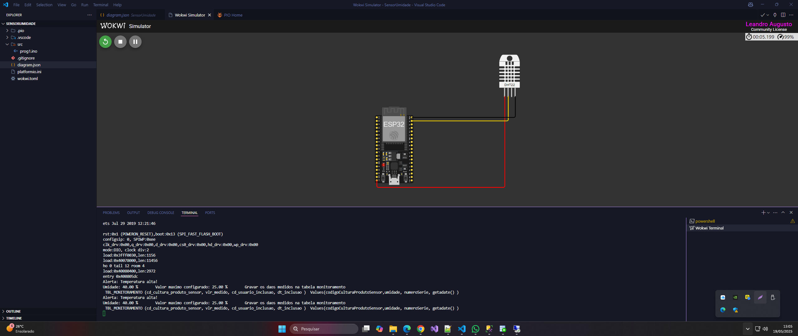
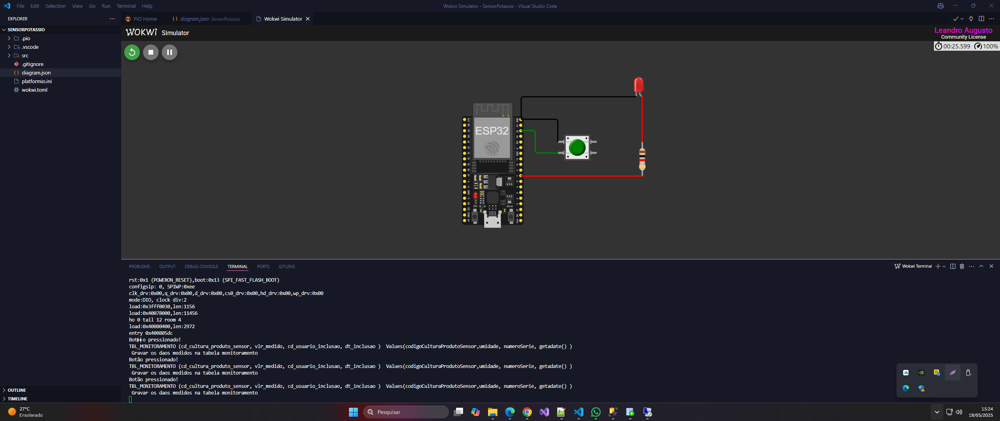
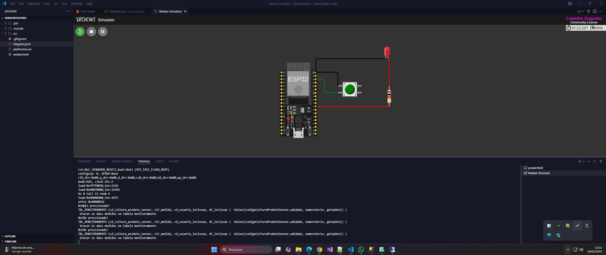
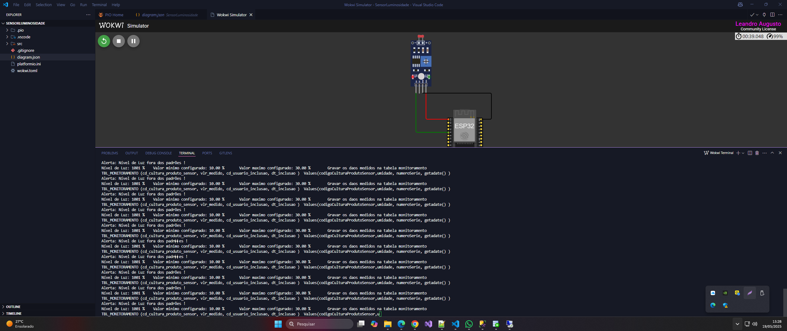

# Projeto Cap 1 - Construindo uma máquina agrícola

## 🎯 Introdução e Objetivo

Funcionamento de sensores agrícolas em um sistema montado na plataforma Wokwi.com.
O controle geral do sistema será realizado por um microcontrolador ESP32, responsável por receber os dados dos sensores e controlar a bomba de irrigação, representada por um relé. O relé poderá ser ligado ou desligado automaticamente de acordo com a lógica criada pelo grupo, e seu status será indicado por um LED embutido (ligado = irrigação ativa, desligado = inativa

### Regras de Negócio

-   Sensores registram leituras a cada 15 minutos, armazenadas em `TBL_MONITORAMENTO`.
-   O sistema compara leituras com valores mínimo/máximo definidos em `TBL_CULTURA_PRODUTO_SENSOR_CONFIGURACAO` para sugerir ajustes.
-   Aplicações de água ou nutrientes são registradas em `TBL_APLICACAO_MONITORAMENTO` apenas quando as leituras estão fora dos limites ideais.

## 👤 Informações do Grupo

-   **Nome:** Daniele Antonieta Garisto Dias
-   **RM:** RM565106
-   **Nome:** Leandro Augusto Jardim da Cunha
-   **RM:** RM561395
-   **Nome:** Luiz Eduardo da Silva
-   **RM:** RM561701
-   **Nome:** Vanessa Teles Paulino
-   **RM:** RM565180
-   **Nome:** João Victor Viana de Sousa
-   **RM:** RM565136
-   **Fase:** 2
-   **Capítulo:** 1 - Um mapa do tesouro

---

## 🔗 Link para o Repositório

https://github.com/LandoAugusto/Fiap_Fase_3_Maquina_Agricola_SENSORES.git
